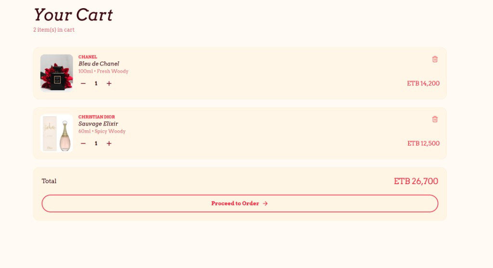
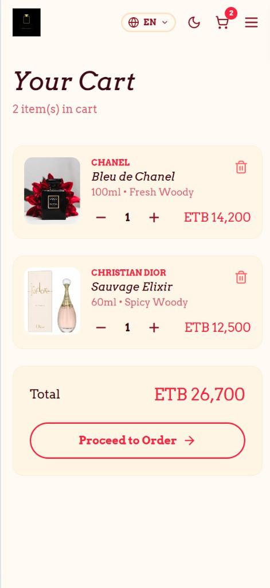
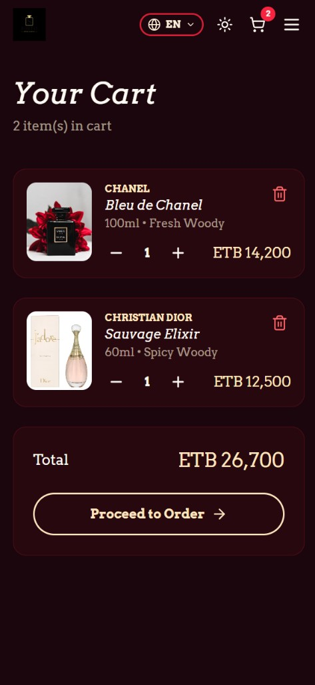
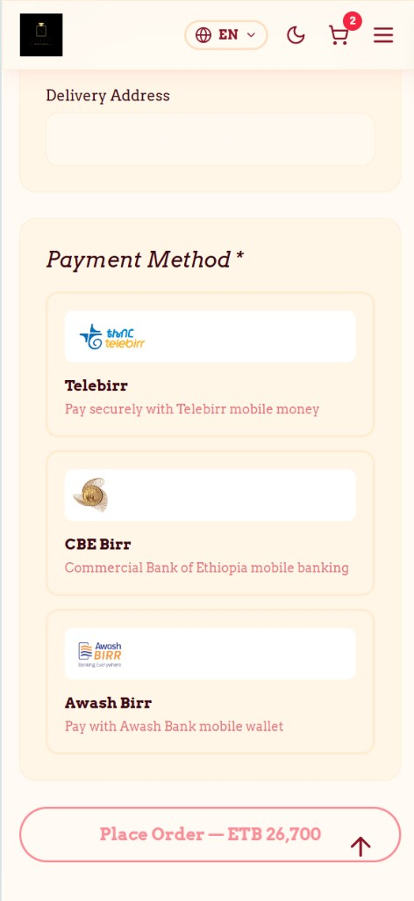
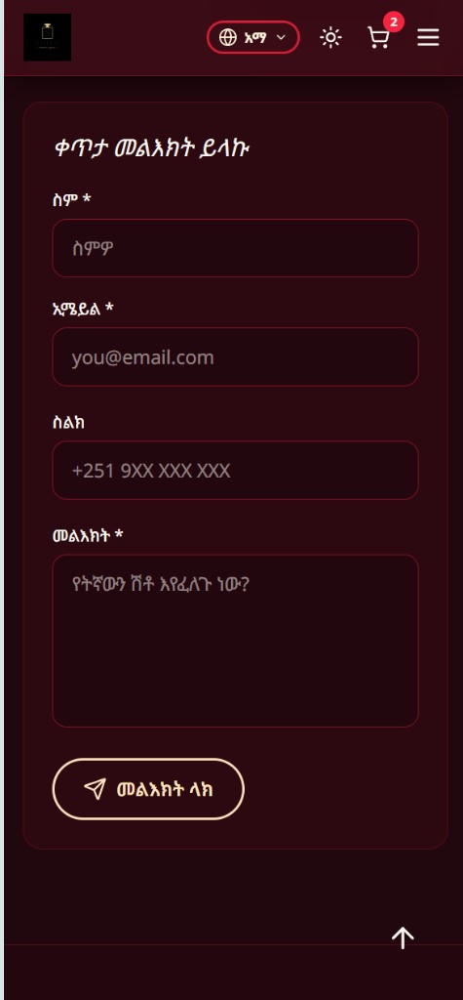
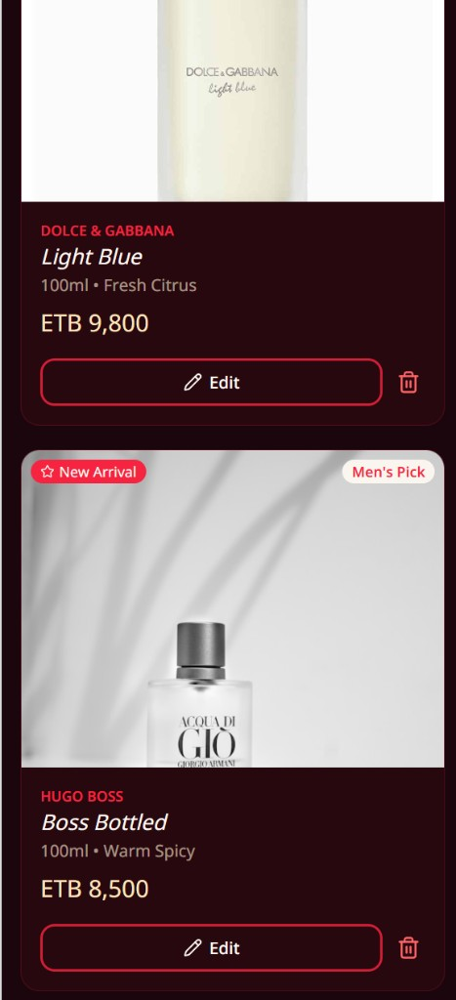
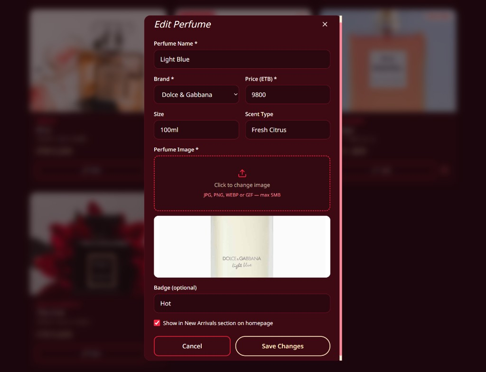

# Shito Store  by segnibultossa97@gmail.com

Premium perfume boutique e-commerce store built for online shopping of perfume 

## Screenshots

### Shopping Cart






### Checkout & Payments


### Contact (Amharic)


### Admin Panel




## Stack

- Frontend: React + Vite + Tailwind CSS v4 + Framer Motion
- Backend: Node.js + Express

## Features

- Animated hero slideshow with floating particles
- New Arrivals section
- Photo gallery synced from perfume listings
- About the shop (location, photo, phone number)
- Contact form with social media links
- Prices page with add-to-cart
- Shopping cart and order flow (Telebirr, CBE Birr, Awash Birr)
- Dark / light mode theme toggle
- Admin panel — register, login, manage perfumes

## Color Palette

 — Cream
 — Warm
 — Accent Red
 — Peach

## Admin

1. Visit http://localhost:5174/admin/register to create the admin account (only works once)
2. Login at http://localhost:5174/admin/login
3. Manage perfumes at http://localhost:5174/admin/dashboard

Posted perfumes appear on **Prices** and random photos show in the **Gallery**.

## Getting Started

```bash
npm run install:all
npm run dev
```

- Frontend: http://localhost:5174
- Backend API: http://localhost:5001

## Project Structure

```
shito store/
├── client/          # React frontend
├── server/          # Express API
│   └── data/        # JSON data store (perfumes, orders, messages)
└── package.json     # Root scripts
```

